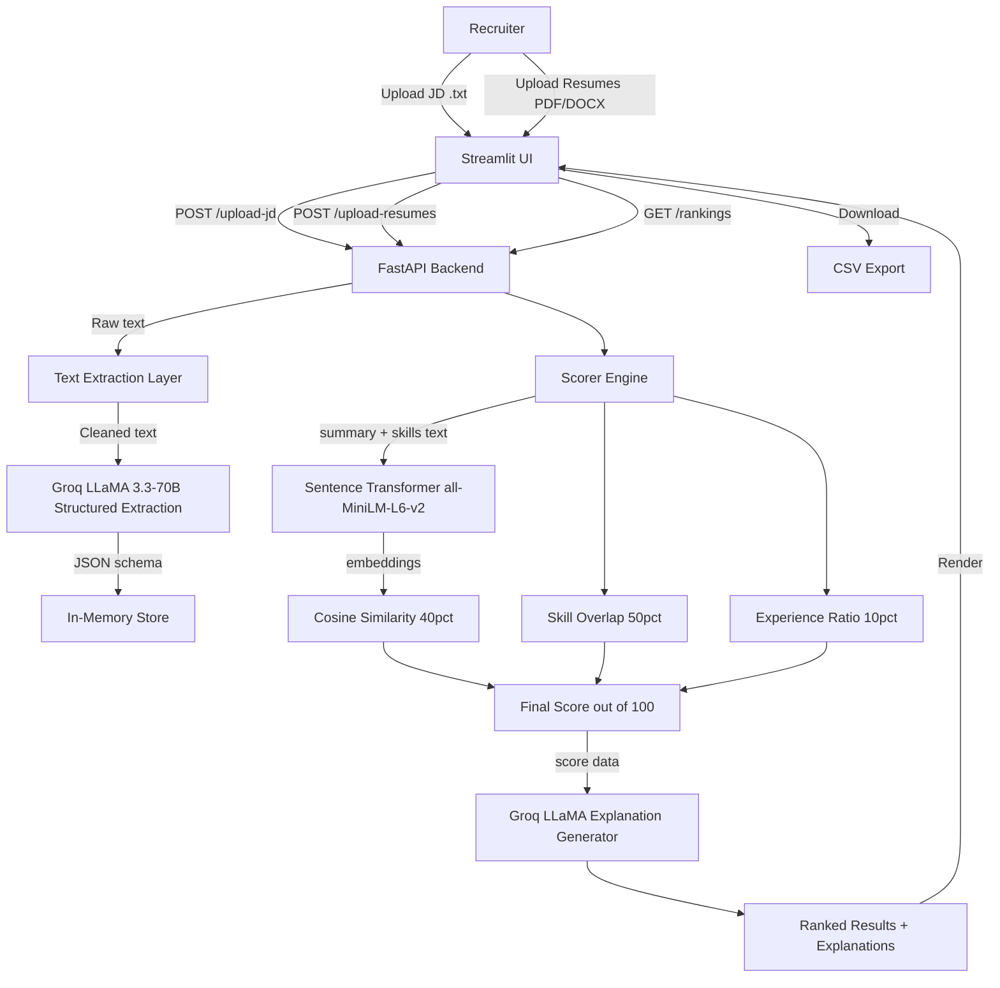

<div align="center">

<!-- Banner -->


# 🎯 Smart Resume Screener

### *AI-Powered Candidate Ranking at the Speed of Thought*

[](LICENSE)
[](https://python.org)
[](https://fastapi.tiangolo.com)
[](https://streamlit.io)
[](https://groq.com)
[](https://github.com/sourabh-550/smart-resume-screener/releases)
[](https://github.com/sourabh-550/smart-resume-screener/stargazers)
[](https://github.com/sourabh-550/smart-resume-screener/network/members)
[](https://github.com/sourabh-550/smart-resume-screener/issues)
[](https://github.com/sourabh-550/smart-resume-screener/commits/main)
[](https://github.com/sourabh-550/smart-resume-screener/graphs/contributors)

</div>

---

## 📑 Table of Contents

- [📌 Project Overview](#-project-overview)
- [✨ Features](#-features)
- [📸 Screenshots](#-screenshots)
- [🎬 Demo](#-demo)
- [🧰 Tech Stack](#-tech-stack)
- [🏗️ Architecture](#️-architecture)
- [📂 Folder Structure](#-folder-structure)
- [⚙️ Installation](#️-installation)
- [🔐 Environment Variables](#-environment-variables)
- [🚀 Usage](#-usage)
- [📡 API Documentation](#-api-documentation)
- [🤖 Machine Learning Pipeline](#-machine-learning-pipeline)
- [🔄 Workflow](#-workflow)
- [🛡️ Security](#️-security)
- [☁️ Deployment](#️-deployment)
- [🛣️ Roadmap](#️-roadmap)
- [⚔️ Challenges Faced](#️-challenges-faced)
- [💡 Lessons Learned](#-lessons-learned)
- [🤝 Contributing](#-contributing)
- [🎨 Code Style](#-code-style)
- [📄 License](#-license)
- [🙏 Acknowledgements](#-acknowledgements)
- [👤 Author](#-author)
- [💬 Support](#-support)
- [❓ FAQ](#-faq)
- [📬 Contact](#-contact)

---

## 📌 Project Overview

**Smart Resume Screener** is a production-ready, AI-driven hiring tool that automates the most time-consuming part of recruitment — screening resumes. Recruiters and hiring managers typically spend 6–8 seconds per resume, often missing the best candidates due to sheer volume.

This application solves that problem by combining:

- 🧠 **LLM-based structured extraction** (Groq × LLaMA 3.3-70B, orchestrated via LangChain) to parse both job descriptions and resumes into clean JSON data
- 📐 **Semantic similarity scoring** (Sentence Transformers — `all-MiniLM-L6-v2`) to measure contextual alignment between a candidate and a role
- 🎯 **Weighted ranking** that blends skill overlap (50%), semantic similarity (40%), and experience match (10%) into a single interpretable score
- 💬 **AI-generated natural language explanations** justifying each candidate's ranking

### Who is this for?

| User | Use Case |
|---|---|
| 🏢 HR Teams | Screen 100+ resumes in minutes, not hours |
| 🧑‍💻 Hiring Managers | Get ranked shortlists with AI-written justifications |
| 🚀 Startups | Affordable, serverless screening with no subscription fees |
| 🎓 Researchers | A clean reference implementation for LLM-powered document ranking |

---

## ✨ Features

- 🔍 **Multi-Resume Upload** — Upload any number of PDF or DOCX resumes in a single batch
- 📄 **Job Description Parser** — Upload a plain `.txt` JD file; LLaMA 3.3-70B extracts skills, roles, experience requirements, and a structured summary
- 🤖 **LLM Extraction** — Both JDs and resumes are parsed into a standardised JSON schema via Groq's ultra-fast inference
- 📊 **Composite Scoring Engine** — Transparent, weighted scoring across three dimensions: semantic fit, skill coverage, and years of experience
- 🧬 **Semantic Embeddings** — `all-MiniLM-L6-v2` sentence embeddings capture meaning beyond keyword matching
- 🏅 **Ranked Candidate Cards** — Visual leaderboard with score pills (🟢 High / 🟡 Mid / 🔴 Low), matched skills, and missing skills
- 💬 **AI-Generated Explanations** — Each candidate gets a 2–3 sentence recruiter-grade commentary on their strengths and gaps
- 📥 **CSV Export** — Download the full ranked results table with one click
- 🌙 **Dark Mode UI** — Premium Streamlit interface styled with custom CSS, Inter font, and gradient accents
- ⚡ **FastAPI Backend** — RESTful API layer for programmatic integration
- 🔄 **Session Reset** — Clear all uploaded data and start a fresh screening session instantly

---

## 📸 Screenshots

<div align="center">

| Home / Upload Screen | Candidate Rankings Dashboard | Score Breakdown Card |
|:---:|:---:|:---:|
|  |  |  |
| *Upload JD and resumes* | *Ranked leaderboard with scores* | *Per-candidate AI explanation* |

</div>

> 📌 *Add your own screenshots to `assets/` — the images above are placeholders until real screenshots are dropped in.*

---

## 🎬 Demo

<div align="center">

### 🌐 Live Demo

> **[🚀 Launch App — Click Here](https://resume-screening-za5ct8g8ukapivatavshtc.streamlit.app)**

---

### 🎥 Video Walkthrough

> *Add a demo video link here once recorded.*

---

### 🖥️ Animated Demo

> *Add `assets/demo.gif` once recorded.*

</div>

---

## 🧰 Tech Stack

| Layer | Technology | Purpose |
|---|---|---|
| **Frontend** | [Streamlit](https://streamlit.io) | Interactive web UI with custom CSS dark theme |
| **Backend API** | [FastAPI](https://fastapi.tiangolo.com) | RESTful endpoints for JD upload, resume upload, and ranking |
| **LLM Orchestration** | [LangChain](https://www.langchain.com) | Prompt orchestration for structured extraction and explanations |
| **LLM Provider** | [Groq](https://groq.com) + LLaMA 3.3-70B | Ultra-fast structured extraction from raw resume/JD text |
| **ML / Embeddings** | [Sentence Transformers](https://www.sbert.net/) `all-MiniLM-L6-v2` | Semantic similarity between candidate and job description |
| **Scoring** | [scikit-learn](https://scikit-learn.org), [NumPy](https://numpy.org) | Cosine similarity, skill overlap, experience matching |
| **PDF Parsing** | [pdfplumber](https://github.com/jsvine/pdfplumber) | Extract text from PDF resumes |
| **DOCX Parsing** | [python-docx](https://python-docx.readthedocs.io) | Extract text from Word document resumes |
| **Data Handling** | [pandas](https://pandas.pydata.org) | Tabular ranking results and CSV export |
| **Config / Secrets** | [python-dotenv](https://pypi.org/project/python-dotenv/) | Environment variable management |
| **Server** | [Uvicorn](https://www.uvicorn.org) | ASGI server for FastAPI |
| **Language** | Python 3.10+ | Core language throughout the stack |

---

## 🏗️ Architecture

<div align="center">


*System Architecture — Smart Resume Screener*

</div>

### How It Works — Step by Step

```
Step 1: User uploads a Job Description (.txt) via the UI
        └─► FastAPI /upload-jd endpoint receives the file
            └─► Groq LLaMA 3.3-70B extracts: skills, experience_years,
                job_titles, education, summary → stored in-memory as JSON

Step 2: User uploads one or many Resumes (.pdf / .docx)
        └─► FastAPI /upload-resumes endpoint processes each file
            ├─► pdfplumber / python-docx extracts raw text
            └─► Groq LLaMA 3.3-70B extracts the same JSON schema per resume

Step 3: User requests Rankings
        └─► FastAPI /rankings endpoint computes scores for each candidate
            ├─► Semantic Score  (40%) — sentence-transformer cosine similarity
            ├─► Skill Match     (50%) — exact set intersection (JD skills ∩ resume skills)
            └─► Experience Score(10%) — resume_years / max(jd_years, 0.5), capped at 1.0

Step 4: AI Explanation generated per candidate
        └─► Groq LLaMA writes a 2-3 sentence recruiter commentary

Step 5: Streamlit renders ranked candidate cards
        └─► Score pill, skill tags (matched / missing), explanation, CSV export
```

---

## 📂 Folder Structure

```
smart-resume-screener/
│
├── 📁 app/                        # Core application modules (FastAPI)
│   ├── __init__.py
│   ├── main.py                    # FastAPI routes: /upload-jd, /upload-resumes, /rankings, /reset
│   ├── parser.py                  # PDF (pdfplumber) and DOCX (python-docx) text extraction
│   ├── extractor.py               # Groq LLaMA structured extraction + AI explanation generation
│   └── scorer.py                  # Semantic similarity, skill overlap, and final score computation
│
├── 📁 data/                       # Sample data for testing
│   ├── jd.txt                     # Example job description (AI/ML Engineer Intern)
│   └── extracted_data.json        # Sample structured extraction output
│
├── 📁 resumes/                    # Sample / uploaded resume files (gitignored)
│
├── 📁 temp_uploads/               # Temporary file buffer during processing (auto-cleaned)
│
├── 📁 assets/                     # Images, GIFs, diagrams for README and UI
│   ├── banner.png
│   ├── home.png
│   ├── dashboard.png
│   ├── result.png
│   ├── architecture.png
│   └── demo.gif
│
├── 📁 .streamlit/                 # Streamlit theme configuration
│   └── config.toml
│
├── app.py                         # Streamlit frontend application (standalone mode)
├── requirements.txt               # Python dependencies
├── .env                           # Environment variables (not committed)
├── .gitignore                     # Git ignore rules
└── README.md                      # This file
```

---

## ⚙️ Installation

> **Prerequisites:** Python 3.10+, `pip`, and a [Groq API Key](https://console.groq.com)

### 1. Clone the Repository

```bash
git clone https://github.com/sourabh-550/smart-resume-screener.git
cd smart-resume-screener
```

### 2. Create & Activate a Virtual Environment

```bash
# Windows
python -m venv venv
venv\Scripts\activate

# macOS / Linux
python -m venv venv
source venv/bin/activate
```

### 3. Install Dependencies

```bash
pip install -r requirements.txt
```

> ⚠️ **Note:** `sentence-transformers` will download the `all-MiniLM-L6-v2` model (~80 MB) on first run. Ensure you have an active internet connection.

### 4. Configure Environment Variables

```bash
cp .env.example .env
# Open .env and add your Groq API key
```

### 5. Run the Streamlit App (Standalone Mode)

```bash
streamlit run app.py
```

The app will open automatically at **http://localhost:8501**

### 6. (Optional) Run the FastAPI Backend Separately

```bash
uvicorn app.main:app --reload --port 8000
```

Interactive API docs available at **http://localhost:8000/docs**

---

## 🔐 Environment Variables

Create a `.env` file in the project root with the following variables:

| Variable | Description | Required | Example Value |
|---|---|---|---|
| `GROQ_API_KEY` | Your Groq API key for LLaMA inference | ✅ Yes | `gsk_xxxxxxxxxxxxxxxxxxxx` |

> 🔒 **Never commit your `.env` file.** It is already included in `.gitignore`.

```env
# .env
GROQ_API_KEY=your_groq_api_key_here
```

---

## 🚀 Usage

### Option A — Streamlit UI (Recommended)

1. **Launch the app:**
   ```bash
   streamlit run app.py
   ```
2. **Upload a Job Description** — Select a `.txt` file describing the role.
3. **Upload Resumes** — Select one or multiple `.pdf` / `.docx` files.
4. **Screen & Rank** — Click **"Screen & Rank Candidates"**. The AI pipeline processes every resume and returns a ranked leaderboard.
5. **Review Results** — Browse candidate cards with scores, matched/missing skills, and AI-written explanations.
6. **Export** — Download the full results as a CSV file.

---

### Option B — FastAPI REST API

```bash
# Step 1: Upload Job Description
curl -X POST "http://localhost:8000/upload-jd" \
  -F "file=@data/jd.txt"

# Step 2: Upload Resumes (multiple files)
curl -X POST "http://localhost:8000/upload-resumes" \
  -F "files=@resumes/candidate_a.pdf" \
  -F "files=@resumes/candidate_b.docx"

# Step 3: Get Rankings
curl -X GET "http://localhost:8000/rankings"

# Step 4: Reset the session
curl -X DELETE "http://localhost:8000/reset"
```

---

## 📡 API Documentation

> Full interactive docs: **http://localhost:8000/docs** (Swagger UI) or **/redoc**

| Endpoint | Method | Description | Request | Response |
|---|---|---|---|---|
| `/` | `GET` | Health check | — | `{"status": "Smart Resume Screener API is running"}` |
| `/upload-jd` | `POST` | Upload & parse a job description `.txt` file | `multipart/form-data: file` | Parsed JD JSON schema |
| `/upload-resumes` | `POST` | Upload & parse multiple `.pdf`/`.docx` resumes | `multipart/form-data: files[]` | Per-file parse status |
| `/rankings` | `GET` | Compute and return ranked candidates | — | Ranked list with scores & explanations |
| `/reset` | `DELETE` | Clear all stored JD and resume data | — | `{"message": "Store cleared"}` |

<details>
<summary>📋 Sample API Response — /rankings</summary>

```json
{
  "jd_summary": "AI/ML Engineer Intern role focused on Python, ML libraries, NLP, and REST APIs.",
  "rankings": [
    {
      "candidate_name": "Jane Doe",
      "final_score": 82.4,
      "semantic_similarity": 78.1,
      "skill_match_pct": 85.0,
      "matched_skills": ["python", "scikit-learn", "fastapi", "nlp", "git"],
      "missing_skills": ["tensorflow", "sql"],
      "experience_years": 1.0,
      "explanation": "Jane demonstrates strong alignment with the role through her proficiency in Python, scikit-learn, and FastAPI. Her NLP experience directly matches the JD core requirements. The primary gaps are TensorFlow and SQL, which are listed as required skills."
    }
  ]
}
```

</details>

---

## 🤖 Machine Learning Pipeline

```
INPUT
 │
 ├── Raw Resume Text (PDF / DOCX)     Raw Job Description Text (.txt)
 │         │                                       │
 └─────────┴───────────────────────────────────────┘
                          │
                          ▼
             Text Extraction Layer
        pdfplumber (PDF) · python-docx (DOCX)
                          │
                          ▼
        LLM Structured Extraction (Groq LLaMA 3.3-70B via LangChain)
        temperature=0.1 for determinism
        Output: name · skills[] · experience_years
                education · job_titles[] · summary
                          │
              ┌───────────┴────────────────┐
              ▼                            ▼
   Skill Overlap (50%)       Semantic Similarity (40%)
   Set Intersection          Sentence Transformer
   Exact match               all-MiniLM-L6-v2
              │               Cosine similarity
              └───────────┬────────────────┘
                          │
                 Experience Score (10%)
                 ratio-based, capped at 1.0
                          │
                          ▼
                 Final Score / 100
          = sem(0.4) + skill(0.5) + exp(0.1)
                          │
                          ▼
         AI Explanation (Groq LLaMA, temperature=0.3)
         2–3 sentence recruiter note per candidate
```

### Scoring Formula

```python
final_score = (
    semantic_score   * 0.40 +   # Contextual / semantic fit
    skill_score      * 0.50 +   # Hard skill coverage
    experience_score * 0.10     # Experience sufficiency
) * 100
```

---

## 🔄 Workflow

```
User Opens App
     │
     ├── [1] Uploads Job Description (.txt)
     │         └─► LLaMA extracts: skills, titles, experience, summary
     │
     ├── [2] Uploads Resume Files (.pdf / .docx)
     │         ├─► Text extracted per file
     │         └─► LLaMA extracts same schema for each candidate
     │
     ├── [3] Clicks "Screen & Rank"
     │         ├─► Sentence Transformer encodes JD + each resume
     │         ├─► Cosine similarity computed
     │         ├─► Skill set intersection computed
     │         ├─► Experience ratio computed
     │         └─► Weighted final score calculated
     │
     ├── [4] AI Generates Explanation
     │         └─► LLaMA writes per-candidate recruiter commentary
     │
     └── [5] Results Displayed
               ├─► Ranked leaderboard (score pill, skill tags)
               ├─► AI explanation per candidate
               └─► CSV export download
```

### 📊 Project Flow Diagram



---

## 🗄️ Database Design

> **Current Implementation:** In-memory store (Python dict) — stateless per session.
> A persistent database layer is planned for v2.0.

<details>
<summary>📐 Planned Schema (v2.0)</summary>

```
┌─────────────────────────┐       ┌──────────────────────────────┐
│   screening_sessions    │       │         candidates            │
├─────────────────────────┤       ├──────────────────────────────┤
│ id (PK)                 │──┐    │ id (PK)                      │
│ created_at              │  └──► │ session_id (FK)              │
│ jd_text                 │       │ filename                     │
│ jd_skills []            │       │ name                         │
│ jd_experience_years     │       │ skills []                    │
│ jd_summary              │       │ experience_years             │
└─────────────────────────┘       │ education                    │
                                  │ final_score                  │
                                  │ semantic_similarity          │
                                  │ skill_match_pct              │
                                  │ explanation                  │
                                  │ created_at                   │
                                  └──────────────────────────────┘
```

**Proposed Storage:** PostgreSQL + SQLAlchemy ORM
**ER Diagram Placeholder:** `assets/er_diagram.png`

</details>

---

## 🛡️ Security

| Area | Implementation |
|---|---|
| **Secrets Management** | All API keys stored in `.env` — never hardcoded or committed |
| **CORS Policy** | Currently `allow_origins=["*"]` for dev — restrict to allowed origins in production |
| **File Validation** | JD restricted to `.txt`; resumes restricted to `.pdf` / `.docx` |
| **Temp File Cleanup** | Uploaded resume files deleted from disk immediately after parsing (`os.remove`) |
| **Input Sanitisation** | LLM prompts use `.format()` with isolated text blocks — no user-controlled template injection |
| **No Persistent PII** | Candidate data stored in-memory only — cleared on session reset or server restart |
| **API Key Exposure** | `GROQ_API_KEY` loaded via `python-dotenv` — never exposed in API responses |

> ⚠️ **Production Note:** Before deploying publicly, restrict CORS origins, add rate limiting, implement authentication (e.g., OAuth2 via FastAPI), and switch to a persistent, encrypted database.

---

## ☁️ Deployment

### 🖥️ Local (Development)

```bash
streamlit run app.py
# OR for the API server:
uvicorn app.main:app --reload --port 8000
```

---

### 🐳 Docker

```dockerfile
FROM python:3.11-slim
WORKDIR /app
COPY requirements.txt .
RUN pip install --no-cache-dir -r requirements.txt
COPY . .
EXPOSE 8501
CMD ["streamlit", "run", "app.py", "--server.port=8501", "--server.address=0.0.0.0"]
```

```bash
docker build -t smart-resume-screener .
docker run -p 8501:8501 --env-file .env smart-resume-screener
```

---

### 🌐 Streamlit Community Cloud

This app is live at: **https://resume-screening-za5ct8g8ukapivatavshtc.streamlit.app**

1. Push your repository to GitHub
2. Go to [share.streamlit.io](https://share.streamlit.io)
3. Connect your GitHub repo and set `app.py` as the main file
4. Add `GROQ_API_KEY` under **Secrets** in the Streamlit Cloud dashboard
5. Click **Deploy** — your app is live!

---

### 🚀 Render

```yaml
services:
  - type: web
    name: smart-resume-screener
    env: python
    buildCommand: pip install -r requirements.txt
    startCommand: streamlit run app.py --server.port $PORT --server.address 0.0.0.0
    envVars:
      - key: GROQ_API_KEY
        sync: false
```

---

<details>
<summary>☁️ AWS / GCP / Azure Deployment Notes</summary>

| Platform | Service | Notes |
|---|---|---|
| **AWS** | Elastic Beanstalk / ECS | Dockerize and push to ECR, deploy via EB or Fargate |
| **GCP** | Cloud Run | `gcloud run deploy` with a Docker image — serverless, autoscales to zero |
| **Azure** | Container Apps | Deploy via Azure Container Registry + Container Apps for managed scaling |

For all cloud deployments, store `GROQ_API_KEY` in the platform's secrets manager and enable HTTPS by default.

</details>

---

## 🛣️ Roadmap

- [x] PDF and DOCX resume parsing
- [x] LLM-based structured extraction (Groq × LLaMA 3.3-70B via LangChain)
- [x] Semantic similarity scoring with Sentence Transformers
- [x] Weighted composite scoring engine
- [x] AI-generated candidate explanations
- [x] Streamlit dark-mode UI with score pills and skill tags
- [x] CSV export of ranked results
- [x] FastAPI REST backend
- [x] Deployed on Streamlit Community Cloud
- [ ] PostgreSQL persistent storage with session history
- [ ] User authentication and multi-tenant support
- [ ] Bulk JD comparison (rank candidates against multiple roles simultaneously)
- [ ] Fuzzy / semantic skill matching (e.g., "ML" ↔ "Machine Learning")
- [ ] Resume anonymisation for bias-free screening
- [ ] Feedback loop — recruiters upvote/downvote rankings to fine-tune weights
- [ ] HuggingFace-hosted open-source model option (no API key required)
- [ ] Email notifications with ranking reports
- [ ] ATS integration (Greenhouse, Lever, Workday)
- [ ] Multilingual resume support
- [ ] Mobile-responsive UI redesign

---

## ⚔️ Challenges Faced

1. **LLM JSON Reliability** — Despite explicit instructions to return raw JSON, Groq's LLaMA occasionally wraps output in Markdown fences. Solved with post-processing strip logic in `extractor.py`.

2. **Skill Matching Granularity** — Exact set-intersection misses semantically equivalent skills (e.g., `"ML"` vs `"Machine Learning"`). Current workaround is lowercase normalisation; fuzzy/semantic matching is on the roadmap.

3. **First-Run Model Download** — `sentence-transformers` downloads the embedding model on first run (~80 MB), which can surprise users in restricted environments.

4. **Stateless In-Memory Store** — Using a Python dict as storage means data is lost on server restart. Acceptable for MVP/demo, but a persistent DB layer is planned for v2.

5. **Experience Estimation** — Many resumes do not explicitly state years of experience. LLaMA estimates from context, which introduces noise in the experience score component.

6. **CORS in Production** — The FastAPI backend defaults to `allow_origins=["*"]` which needs to be locked down for production deployments.

---

## 💡 Lessons Learned

- **LLMs are excellent at structured extraction** but require defensive output parsing — always handle malformed responses gracefully.
- **Combining lexical and semantic scoring** produces significantly better rankings than either approach alone. The 50/40/10 weight split was tuned empirically.
- **Groq's inference speed** (sub-2-second responses on 70B models) makes real-time LLM pipelines genuinely practical for production UX.
- **Streamlit's custom CSS capabilities** are powerful enough to build polished, near-production UIs — but require careful specificity management.
- **Separation of concerns** (parser → extractor → scorer as independent modules) made iterative improvements far easier than a monolithic design would have.

---

## 🤝 Contributing

Contributions are warmly welcomed!

```bash
# 1. Fork the repository on GitHub

# 2. Clone your fork
git clone https://github.com/YOUR_USERNAME/smart-resume-screener.git
cd smart-resume-screener

# 3. Create a feature branch
git checkout -b feature/your-feature-name

# 4. Make your changes and commit
git add .
git commit -m "feat: add your feature description"

# 5. Push to your fork
git push origin feature/your-feature-name

# 6. Open a Pull Request on GitHub
```

### Guidelines

- Follow the existing code style (see [Code Style](#-code-style))
- Write clear, descriptive commit messages (prefer [Conventional Commits](https://www.conventionalcommits.org/))
- Add or update docstrings for any new functions
- Test your changes locally before opening a PR
- Reference the related issue in your PR description (`Closes #123`)

---

## 🎨 Code Style

| Tool | Purpose |
|---|---|
| [Black](https://black.readthedocs.io) | Opinionated Python code formatter — `black .` |
| [isort](https://pycqa.github.io/isort/) | Import sorting — `isort .` |
| [Flake8](https://flake8.pycqa.org) | Linting — `flake8 app/` |
| [mypy](https://mypy-lang.org) | Optional static type checking |

**Naming Conventions:**
- Functions and variables: `snake_case`
- Classes: `PascalCase`
- Constants: `UPPER_SNAKE_CASE`
- Private helpers: `_prefixed_snake_case`

```bash
# Format before committing
black .
isort .
flake8 app/
```

---

## 📄 License

This project is licensed under the **MIT License**.

```
MIT License

Copyright (c) 2026 sourabh-550

Permission is hereby granted, free of charge, to any person obtaining a copy
of this software and associated documentation files (the "Software"), to deal
in the Software without restriction, including without limitation the rights
to use, copy, modify, merge, publish, distribute, sublicense, and/or sell
copies of the Software, and to permit persons to whom the Software is
furnished to do so, subject to the following conditions:

The above copyright notice and this permission notice shall be included in all
copies or substantial portions of the Software.

THE SOFTWARE IS PROVIDED "AS IS", WITHOUT WARRANTY OF ANY KIND, EXPRESS OR
IMPLIED, INCLUDING BUT NOT LIMITED TO THE WARRANTIES OF MERCHANTABILITY,
FITNESS FOR A PARTICULAR PURPOSE AND NONINFRINGEMENT.
```

See the full [LICENSE](LICENSE) file for details.

---

## 🙏 Acknowledgements

| Resource | Contribution |
|---|---|
| [Groq](https://groq.com) | Lightning-fast LLaMA 3.3-70B inference API |
| [LangChain](https://www.langchain.com) | LLM orchestration and prompt management |
| [Sentence Transformers](https://www.sbert.net/) | `all-MiniLM-L6-v2` — efficient, accurate semantic embeddings |
| [FastAPI](https://fastapi.tiangolo.com) | Modern, high-performance Python web framework |
| [Streamlit](https://streamlit.io) | Rapid ML app development framework |
| [pdfplumber](https://github.com/jsvine/pdfplumber) | Reliable PDF text extraction |
| [python-docx](https://python-docx.readthedocs.io) | DOCX document parsing |
| [scikit-learn](https://scikit-learn.org) | Cosine similarity computation |
| [pandas](https://pandas.pydata.org) | Data manipulation and CSV export |
| [Inter Font](https://fonts.google.com/specimen/Inter) | Clean, modern UI typography |
| Open Source Community | Inspiration, libraries, and best practices |

---

## 👤 Author

<div align="center">

| | |
|---|---|
| **GitHub** | [@sourabh-550](https://github.com/sourabh-550) |
| **HuggingFace** | [@sourabh5500](https://huggingface.co/sourabh5500) |

</div>

---

## 💬 Support

If you find this project useful, please consider:

- ⭐ **Starring this repository** — it helps others discover the project
- 🍴 **Forking** to build your own version or contribute improvements
- 🐛 **[Reporting Issues](https://github.com/sourabh-550/smart-resume-screener/issues)** — bugs, edge cases, and unexpected behaviour
- 💡 **[Suggesting Features](https://github.com/sourabh-550/smart-resume-screener/issues/new?template=feature_request.md)** — ideas that would make this tool better for everyone

---

## ❓ FAQ

<details>
<summary><strong>Q: Do I need a paid Groq API key?</strong></summary>

Groq offers a generous **free tier** sufficient for personal use and moderate screening volumes. Sign up at [console.groq.com](https://console.groq.com). Paid plans are available for high-volume production workloads.

</details>

<details>
<summary><strong>Q: What file formats are supported for resumes?</strong></summary>

Currently `.pdf` and `.docx` are supported. Plain `.txt` resumes are not currently handled but are on the roadmap.

</details>

<details>
<summary><strong>Q: How accurate is the AI scoring?</strong></summary>

The scoring engine combines three signals: semantic embedding similarity, skill set overlap, and experience ratio. It performs well for straightforward technical roles. A feedback loop feature is planned to improve calibration over time.

</details>

<details>
<summary><strong>Q: Is candidate data stored anywhere?</strong></summary>

No. All data is stored **in-memory only** during the current session. It is cleared when you click "Reset" or when the server restarts. No PII is written to disk beyond temporary upload files, which are deleted immediately after parsing.

</details>

<details>
<summary><strong>Q: Can I use a different LLM (e.g., OpenAI GPT-4 or a local model)?</strong></summary>

Yes — `extractor.py` is modular. You can swap the `Groq` client for the `openai` client (or any OpenAI-compatible API) by changing the client initialisation and model name. Local model support via Ollama is a planned feature.

</details>

<details>
<summary><strong>Q: Can I screen resumes in languages other than English?</strong></summary>

The current pipeline is optimised for English. LLaMA 3.3-70B has multilingual capabilities so extraction may work partially for other languages, but accuracy is not guaranteed. Full multilingual support is on the roadmap.

</details>

<details>
<summary><strong>Q: How many resumes can I screen at once?</strong></summary>

There is no hard limit in the code. Practical limits are determined by Groq API rate limits and available memory. In testing, batches of 20–50 resumes process smoothly. For larger batches, consider adding a queue (e.g., Celery + Redis).

</details>

---

## 📬 Contact

Have questions, collaboration ideas, or just want to say hello?

<div align="center">

| Platform | Link |
|---|---|
| 🐙 GitHub | [github.com/sourabh-550](https://github.com/sourabh-550) |
| 🤗 HuggingFace | [huggingface.co/sourabh5500](https://huggingface.co/sourabh5500) |

</div>

---

<div align="center">

**Made with ❤️ and a lot of ☕ by [sourabh-550](https://github.com/sourabh-550)**

*If this project helped you, a ⭐ star goes a long way — thank you!*

[](https://star-history.com/#sourabh-550/smart-resume-screener&Date)

</div>